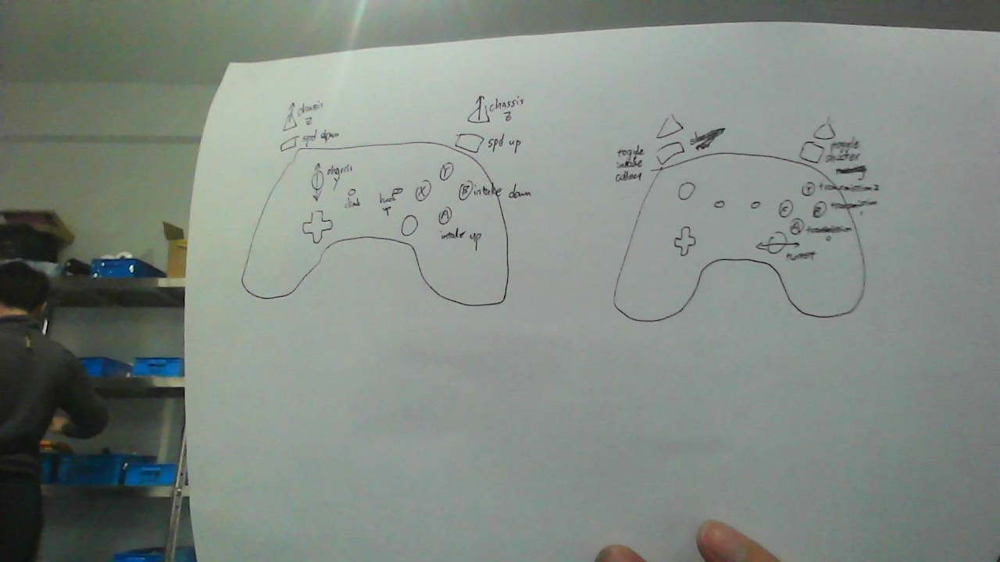

# Supernova Team 5451 2021 Robot Code: Dark Nightly

## Controls

## TODOs

- BUG: Shooter cannot turn while running "Shoot" command

- IMPROVE: increase shooter turn velocity (power). 

- The second part of transmission is not tested yet, direction is not determined. DO NOT ENABLE TRANSMISSION motor_0 AND motor_1 AT THE SAME TIME WITHOUT TESTING!!!
